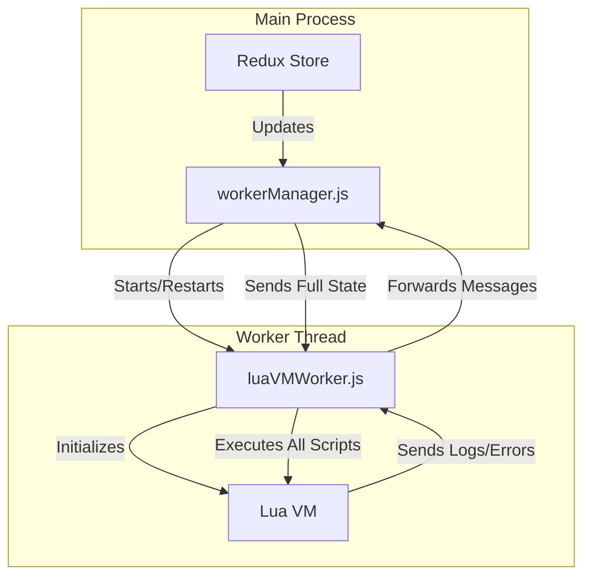
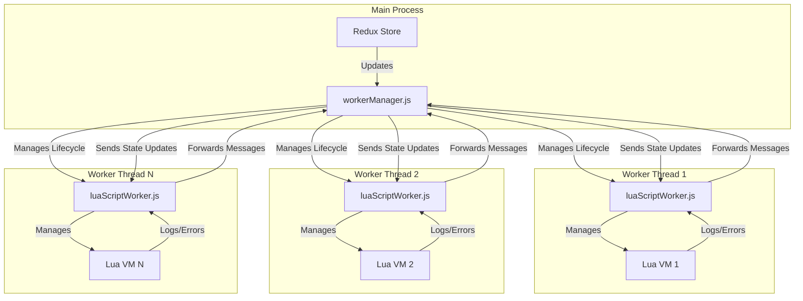

# Lua Script Execution Refactor Plan

This document outlines the plan to refactor the Lua script execution system from a monolithic worker to a modular, one-worker-per-script architecture.

## Current Architecture

The current system uses a single, monolithic worker (`luaVMWorker`) to manage all persistent scripts. The `workerManager` is responsible for starting this worker and restarting it whenever any script is enabled, disabled, or modified. This creates a bottleneck and leads to inefficient state management.

## Proposed Architecture

The new architecture will be modular. The `workerManager` will be responsible for spawning a dedicated, lightweight worker for each enabled persistent script. This isolates scripts from each other, improves performance, and simplifies state management.

## Detailed Plan

Here is the step-by-step plan to implement this refactor:

### Phase 1: Create the New Script Worker

1.  **Create `electron/workers/luaScriptWorker.js`**: This new file will be a lightweight worker responsible for executing a single Lua script. It will:
    *   Receive the script's `id`, `code`, `loopMin`, and `loopMax` via an initial message.
    *   Initialize a `wasmoon` Lua engine.
    *   Expose the necessary helper functions (`print`, `keyPress`, `wait`, etc.) to the Lua environment, just as the old worker did.
    *   Receive state updates from the `workerManager` and expose the `gameState` to Lua.
    *   Contain a persistent loop that executes the script, waits for a random duration between `loopMin` and `loopMax`, and then repeats.
    *   Send log messages and errors back to the `workerManager`, including its unique `scriptId`.

### Phase 2: Refactor the Worker Manager

1.  **Modify `electron/workerManager.js`**: This is the most significant part of the refactor.
    *   Remove the logic for starting the single `luaVMWorker`.
    *   Introduce a new `Map` to store running workers, mapping `scriptId` to the `Worker` instance.
    *   Overhaul the `handleStoreUpdate` method. This method will now be the central orchestrator:
        *   It will get the list of enabled `persistentScripts` from the Redux state.
        *   It will compare this list with the map of running workers.
        *   **For new scripts**: If a script is enabled but has no running worker, it will spawn a new `luaScriptWorker.js` instance for it.
        *   **For disabled/removed scripts**: If a worker is running for a script that is no longer enabled (or has been deleted), it will terminate that worker.
        *   **For updated scripts**: If an enabled script's `code`, `loopMin`, or `loopMax` has changed, it will terminate the old worker and start a new one with the updated configuration.
    *   The logic for sending state updates will be modified to broadcast the new state to *all* running script workers.

### Phase 3: Code Cleanup and Removal of Old Logic

1.  **Remove Snippet Code**: Perform a search for `'script-snippet'` and `SNIPPET_SCRIPT_ID` across the codebase and remove all related logic.
2.  **Deprecate Old Worker**: Once the new system is in place and tested, `electron/workers/luaVMWorker.js` will be deleted.
3.  **Clean up `workerManager.js`**: All code related to the old `luaVMWorker` (like the complex restart logic) will be removed, resulting in a cleaner, more maintainable file.